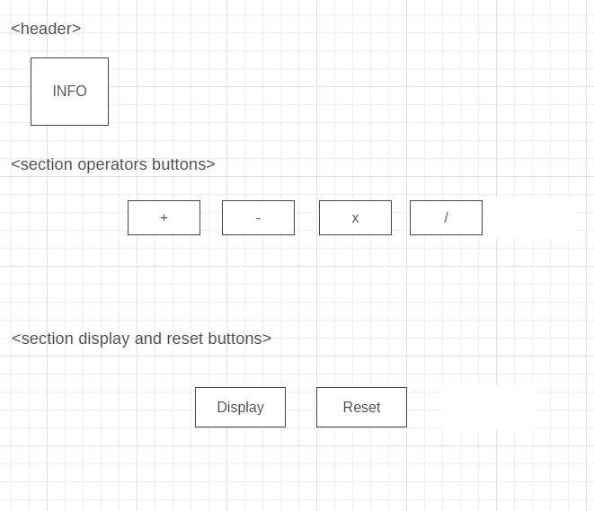

# Development Strategy

> `Debugging-project-calculator-week-2`

- This project is about development a simple calculate  with user-input functions in `Javascript` and with applying html, css,  incremental-development, adding git-branches per every step of dev-strategy, merging by pull-request and closes issues with colaborating of 2 students. 
- This project would interest for novice students of web-development because there is example of simple functions in `Javascript`,  applying colaboration and incremental-development.

## Wireframe

## 0. Set-Up

__A User can see my initial repository and live demo__

### Repo

- Generate from Template
- Write initial, basic README
- Turn on GitHub Pages

## 1. HTML

__As visitor I expect see clickable buttons on the page with information and operators buttons so that as a user I can calculate two numbers__

### Repo

developed on a branch called `html` by `Razvan`

### What change?

- Add  buttons with names
- Add property `onclick` to each of buttons
- Add links to functions JS and links to files `.js`
- Add link to file `.css`

----

## 2. CSS

__As visitor I expect to see my buttons in the center of the page__

### Repo

developed on a branch called `css` by `Razvan`

### What change?

- Add css properties for buttons
- Add margin property  the buttons

----

## 3. Button "Add"

__As visitor I expect see button which__

### Repo

developed on a branch called `01-add` by `Razvan`

### What change?

- 
- 
----

## 4. Button  "Substract"

__As visitor I expect see the button when__

### Repo

developed on a branch called `02-substract` by `Razvan`

### What change?

- 
- 

----

## 5. Button  "Multiply"

__As visitor I expect see the button that__

### Repo

developed on a branch called `03-multiply` by `Olga`

### What change?

----

## 6. Button "Divide"

__As visitor I expect see a button that__

### Repo

developed on a branch called `04-divide` by `Olga`

### What change?

----

## 7. Button "Display"

__As visitor I expect see a button for displaying the result__

### Repo

developed on a branch called `05-display` by `Olga`

### What change?

----

## 8. Button 6 "Reverse-a-string"

__As visitor I expect see a button that__

### Repo

developed on a branch called `06-reset` by `Olga`

### What change?

----

## Finishing Touches

- Write final, complete README:
- Validate code to check for any last mistakes
